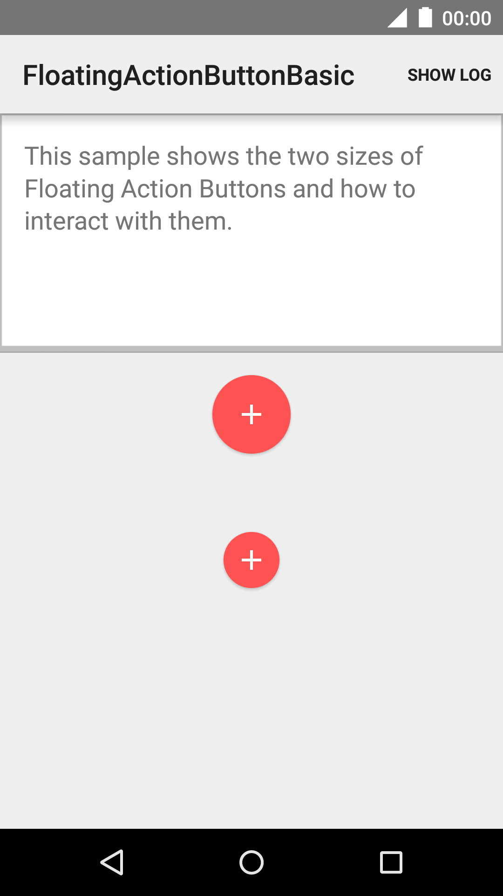
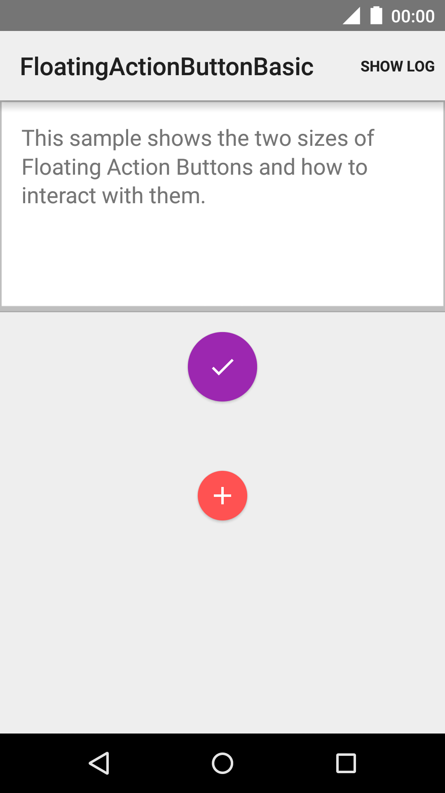
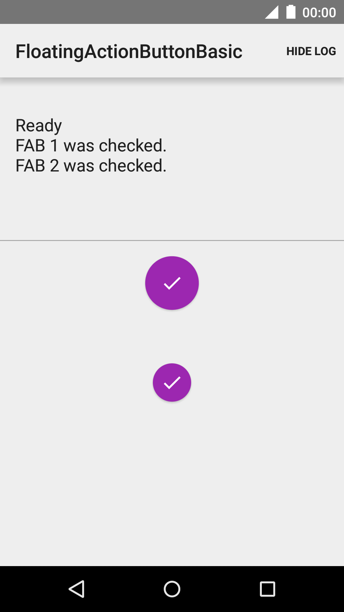
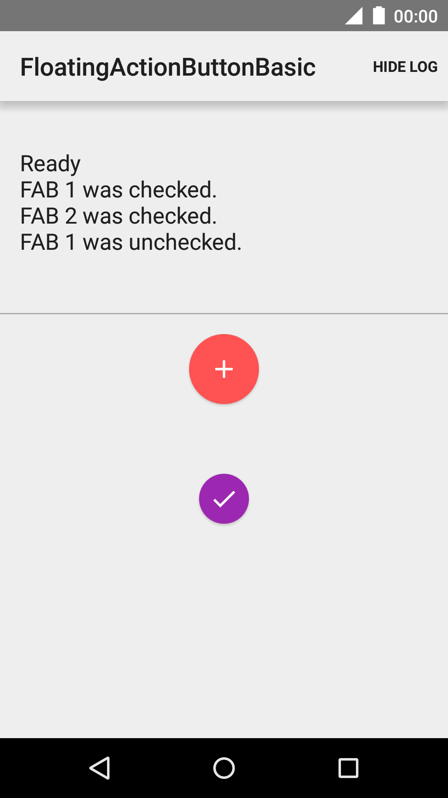

Android FloatingActionButtonBasic Sample
===================================

This sample shows the two sizes of Floating Action Buttons and
how to interact with them.

Introduction
------------

This sample shows how to implement a [Checkable][1] Floating Action Button.

Floating action buttons are used for a special type of promoted action.
They are distinguished by a circled icon floating above the UI and have
special motion behaviors related to morphing, launching, and the transferring anchor point.

Floating action buttons come in two sizes:
the default, which should be used in most cases, and the mini,
which should only be used to create visual continuity with other elements on the screen.

Both sizes of Floating Action Buttons are displayed on screen.

[1]: https://developer.android.com/reference/android/widget/Checkable.html

Pre-requisites
--------------

- Android SDK 25
- Android Build Tools v25.0.3
- Android Support Repository

Screenshots
-------------

     

Getting Started
---------------

This sample uses the Gradle build system. To build this project, use the
"gradlew build" command or use "Import Project" in Android Studio.

Support
-------

- Google+ Community: https://plus.google.com/communities/105153134372062985968
- Stack Overflow: http://stackoverflow.com/questions/tagged/android

If you've found an error in this sample, please file an issue:
https://github.com/googlesamples/android-FloatingActionButtonBasic

Patches are encouraged, and may be submitted by forking this project and
submitting a pull request through GitHub. Please see CONTRIBUTING.md for more details.

License
-------

Copyright 2017 The Android Open Source Project, Inc.

Licensed to the Apache Software Foundation (ASF) under one or more contributor
license agreements.  See the NOTICE file distributed with this work for
additional information regarding copyright ownership.  The ASF licenses this
file to you under the Apache License, Version 2.0 (the "License"); you may not
use this file except in compliance with the License.  You may obtain a copy of
the License at

http://www.apache.org/licenses/LICENSE-2.0

Unless required by applicable law or agreed to in writing, software
distributed under the License is distributed on an "AS IS" BASIS, WITHOUT
WARRANTIES OR CONDITIONS OF ANY KIND, either express or implied.  See the
License for the specific language governing permissions and limitations under
the License.
